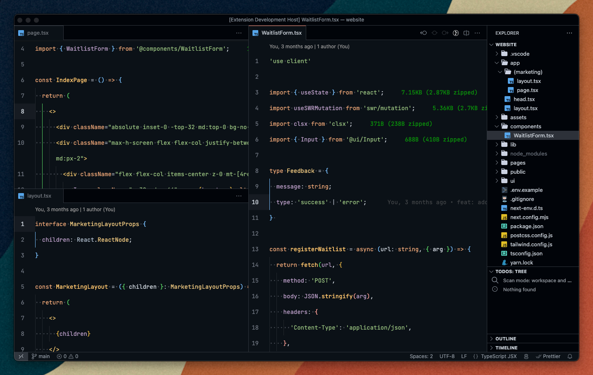
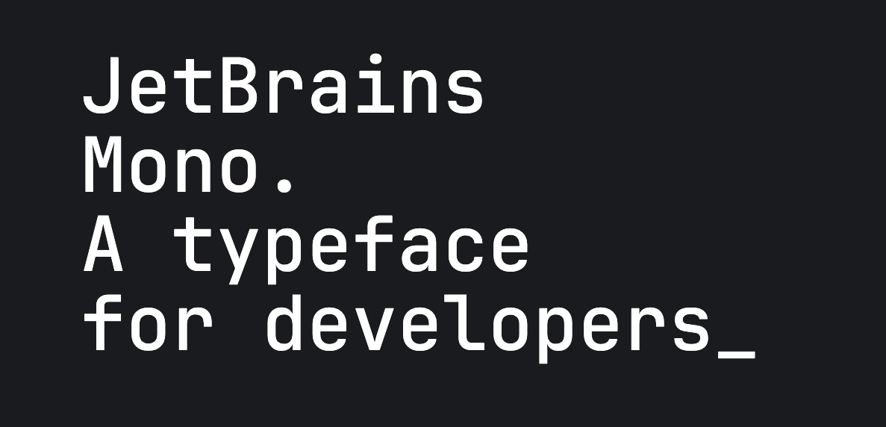

# Tuffybrain
Visual Studio Theme inspired by Jetbrains with better accesible colors ✨



## Installation
1. Go to `Extensions: Install extension` using the Command Palette(`Ctrl+Shift+P` or `Cmd+Shift+P` on Mac).
2. Search for `Tuffybrain`.
3. Click install.
4. From the Command Palette go to `Preferences: Color Theme` and find Tuffybrain.
5. Pick your favorite theme.
6. Enjoy!

## Preferences
For a better UI experience I recommend to disable `Activity Bar` and use only the command palette. If you like Jetbrains products you can [download](https://www.jetbrains.com/lp/mono/) and use the `Jetbrains Mono Font`.



Enable Ligatures to enjoy the whole experience:
```
"editor.fontFamily": "Jetbrains Mono",
"editor.fontLigatures": true,
```

## Feedback
Did you find an issue? Feel free to create an issue I'm sure there are things I missed. Any relevant changes for each version are documented in the changelog. Please update and check the [changelog](./CHANGELOG.md) before create any issue, as they may have already been taken.

Any questions or feedback open an issue on [Github](https://github.com/coderdiaz/tuffybrain-vscode-theme).

Crafted by [Javier Diaz](https://coderdiaz.dev).